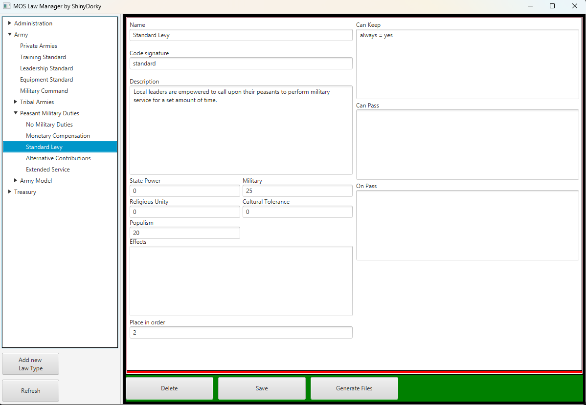

# MOS Law Manager - frontend
A SpringBoot/JavaFX meant to work alongside a
[REST API](https://github.com/ShinyDorky/law_generator_backend)
in order to help me with creating and managing laws in my CK3 mod.

## How to use

### Loading data
Once the REST API is running, you can load the existing files by clicking the refresh button.

### Creating new entities
You can create a new Law Type by pressing the `Add new Law Type` button. If you want to add a law group od option,
select a parent entity for your intended creation and press the `Add Child` button. Doing so will open an interface with
empty fields relevant for the item that you want to create. Once you fill the fields, click `Create New Item` in order
to save the new entity in the database.

### Modifying existing entities
Once you select any entity in the dropdown menu on the left, you can change any value associated with it. Once you are
done, simply click `Save`.

### Deleting entities
Simply select an entity and click the `Delete` button. Doing so will delete said entity as well as any entities under
it.

### Generating files
Select either a Law Group or a Law Option that you want to generate files for and click the `Generate Files` button.
Said files will appear in the `OUTPUT` folder in the app's directory.

## Template Files
Files contained within the `Templates` folder are plain .txt files containing code that should be generated at the
request of a user. There are separate sub-folders for Law Groups and Law Options. Generating files will replace custom
markers with values appropriate for chosen item and create an output file for every template file.

### Markers
Markers are enclosed in the angle brackets `<>` and indicate what information should be present in the output file.
Most of them correspond 1-to-1 to attributes of the entities.

#### Law Options
- `X:name`
- `X:signature`
- `X:desc`
- `X:group` - inserts the signature of a law group this option belongs to
- `X:can_keep`
- `X:can_pass`
- `X:effects`
- `X:neighbours` - the line containing this marker will be duplicated for every neighbouring law option and have their
signature inserted in the marker's place
- `X:neighbours-1` - same as `X:neighbours`, but only the neighbours with a lower order value will be considered
- `X:neighbours+1` - same as `X:neighbours`, but only the neighbours with a higher order value will be considered
- `X:OPINIONS_UPGRADE` - inserts appropriate opinion modifiers in case of upgrading law (moving from a lower place in 
- the order)
- `X:OPINIONS_DOWNGRADE` - inserts appropriate opinion modifiers in case of upgrading law (moving from a higher place in
- the order)

#### Law Groups
- `X:name`
- `X:signature`
- `X:desc`
- `X:law_type` - inserts the signature of a law type this group belongs to
- `X:lawOptions` - for every law option within this group, the contents of a law option template with the same name
as the one currently generated is inserted with appropriate values

## Defined entities
- Law Types - broad categories of Law Groups, defined by what area of state they pertain to (army, economy, etc)
    - signature - how the law type will be represented in the mod script
    - name - how the law type will be represented in the mod UI
- Law Groups - groups of mutually exclusive law options (permissions for private armies, levy obligations, etc)
    - signature - how the law group will be represented in the mod script
    - name - how the law group will be represented in the mod UI
    - desc - how the law group will be described (NOT visible to the player)
- Law Options - individual laws
    - signature - how the law option will be represented in the mod script
    - name - how the law option will be represented in the mod UI
    - desc - how the law option will be described (visible to the player)
    - canKeep - conditions that a character needs to satisfy in order to keep this law
    - canPass - conditions that a character needs to satisfy in order to either pass this law or have this law be proposed
    - effects - modifiers that will be applied to everyone who has this law
    - placeInOrder - which place in the law group does this law have, laws can be passed only when having a law that
      either has the same place or is adjacent to the considered law
    - passCost - resources that will be consumed on passing of this law
    - onPass - effects that will be called the moment this law is passed
    - Law opinion multipliers - how much the followers of particular ideas will like or dislike this law

Name and signature fields are mandatory in every type of entity.

## Usage
Use ``mvn clean package`` to generate a .jar file. In the target folder a .jar file named `Law Generator - Frontend`
will be created.

You can run it by double-clicking it as long as you have Java on your machine.

Alternatively you can download both files in a 
[release package](https://github.com/ShinyDorky/law_generator_frontend/releases/tag/1.0.0).

## Requirements
As long as you have Java installed, it should run.

## Design Decisions

### Why are `X:OPINIONS_UPGRADE` and `X:OPINIONS_DOWNGRADE` so simple?
Due to the nature of my mod, either way I have to tweak these values a lot with multiple edge cases and exceptions. 
As such, the opinion values inserted in the app files tend to be more of a guideline than a rigid standard. In these
circumstances I have decided that it would be inefficient to create a massive, hard to upkeep IF statement for something,
that at worst takes me around 5 minutes per law group.